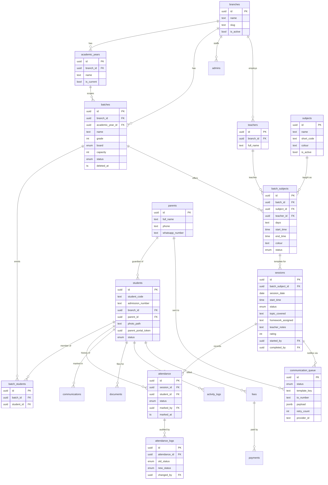

# Chalkboard OS — Architecture

Version **0.3.1** (Release Candidate). This document is the map: domain model,
entity relationships, request flow, and the security model.

## Domain model

```
Organization (implicit, single-tenant today)
  └── Branch
        └── Academic Year
              └── Batch  ── (fixed group of students)
                    ├── Batch Students   (enrolment)
                    └── Batch Subject    (subject + teacher + schedule = template)
                          └── Session     (one occurrence on a date)
                                └── Attendance   (one row per student)
                                      └── Communication Queue → WhatsApp
```

A **Batch Subject** carries `days[]` + `start_time` + `end_time` and therefore
acts as a recurring **session template**: Today's Sessions materialises a
`session` row on first *Start Session*. No cron is required.

Attendance belongs **only** to a Session — never directly to a Batch or Batch
Subject — so a student can attend multiple sessions per day cleanly.

## ER diagram



> Legacy `classes` / `class_students` tables remain from before the 0005 refactor
> for rollback safety. They are unused by the app.

## Request flow

- **Rendering**: Server Components fetch via a cookie-bound Supabase client
  (`src/lib/os/supabase-server.ts`) that runs as the signed-in user, so RLS
  applies. No service-role key is used in the portal.
- **Mutations**: Server Actions (`actions.ts` per feature folder) validate input
  with Zod, write via the same RLS-scoped client, and `revalidatePath`.
- **Auth guard**: `middleware.ts` refreshes the session and bounces anonymous
  users to `/admin/login`; `requireAdmin()` additionally checks the `admins`
  allowlist. `requireSuperAdmin()` gates the Developer panel.

## Attendance save ordering (durability)

`finishSession` commits in this exact order so attendance is safe before any
messaging is attempted:

1. `sessions` upsert (+ class notes, rating)
2. `attendance` upsert — the durable core
3. `attendance_logs` for changed rows (old → new, admin, timestamp)
4. `activity_logs` (summary + per-student)
5. session marked `completed`
6. **only then** enqueue `communication_queue` rows
7. best-effort `processQueue()` dispatch (skipped cleanly without Meta creds)

WhatsApp being down or unconfigured can never lose attendance.

## Identity & Access Management (v0.4.0)

Authorization is a central **capability model** in `src/lib/os/permissions.ts` —
the single source of truth used by nav, page guards and every Server Action.

- **Roles** (descending authority): `super_admin > admin > teacher > reception >
  parent > student`. Parent/Student are reserved for future read-only portals.
- **Capabilities** (e.g. `students.manage`, `attendance.mark`, `users.manage`)
  map to roles in `ROLE_CAPABILITIES`. `can(role, cap)` is the only check.
- **Enforced in four layers** (never hidden buttons):
  1. **Middleware** — session guard on `/admin`.
  2. **Page guards** — `requireCapability(cap)` / `requireAnyCapability([...])`
     at the top of every server page; unauthorized → redirect to `/admin`.
  3. **Server Actions** — every mutation calls `requireCapability(...)` first.
  4. **Database RLS** — role-aware policies: `admins`/`feature_flags`/
     `system_settings` writes are `super_admin`-only (`is_super_admin()`);
     users may update their own row but a trigger blocks role/status escalation.
- **Auth tracking**: `last_login_at`, `last_seen_at` (throttled), `last_device`.
- **Audit**: login, logout, failed/denied login, user created/disabled/enabled,
  role changed, password reset/changed → `activity_logs`.
- **Safety**: `must_change_password` (forced change page), disable, soft-delete,
  and a DB trigger (`guard_last_super_admin`) that makes it impossible to remove
  the last active Super Admin. Super Admin transfer promotes a target first,
  then optionally steps the actor down — never leaving zero super admins.
- **User creation** uses the Supabase Admin API (service role, server-only) to
  mint the auth user with a one-time temporary password, then links the
  `admins` row; the auth user is rolled back if the row insert fails.

## Security model (baseline)

- **RLS on every table**; broad read via `is_active_admin()`, sensitive writes
  gated by role helpers (`is_super_admin`, `is_admin_tier`, `current_admin_role`).
- **Roles**: `super_admin | admin | teacher | reception | parent | student`
  (super_admin + admin active now).
- **Storage**: `student-photos` and `student-documents` are private; the app
  serves short-lived signed URLs.
- **Secrets**: only `NEXT_PUBLIC_SUPABASE_*` (safe) reach the client; service-role
  and Meta tokens are server-only env vars. `.env.local` is gitignored.

## Feature flags

`feature_flags` rows drive nav visibility and are toggled live from the Developer
panel. Enabled: dashboard, students, attendance, whatsapp, classes(Batches).
Disabled until their phase: homework, fees, payments, teacher/parent/student
portals, ai_reports, analytics, qr_attendance.

## Folder map

```
middleware.ts                         /admin session guard
src/lib/os/       supabase-server · auth · flags · types · storage · attendance
                  · sessions · whatsapp · health · version · useFormDraft
src/app/admin/login/                  login page + actions
src/app/admin/(portal)/               auth-guarded shell (layout, dashboard)
  students/ batches/ subjects/ attendance/ settings/ developer/ whatsapp/
  fees/ analytics/                    (flag-gated placeholders)
src/components/admin/                  reusable admin UI
supabase/migrations/                  0001 … 0007 (run in order)
```
